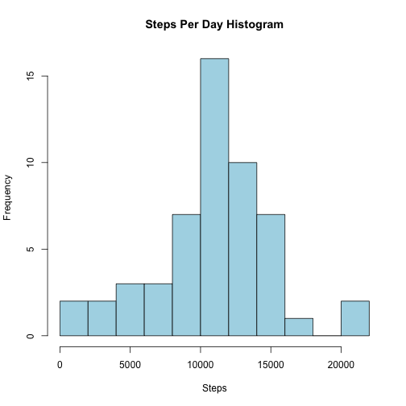
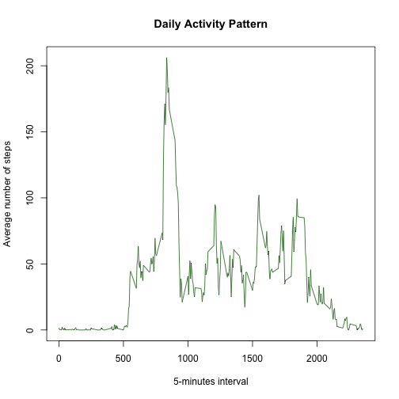
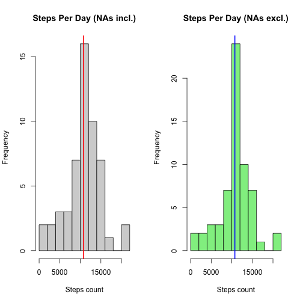
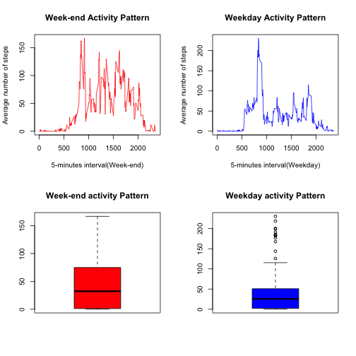

## Loading and preprocessing the data
Get the data and format the date column

```r
rem_file<-"https://d396qusza40orc.cloudfront.net/repdata%2Fdata%2Factivity.zip"
loc_file<-"activity.zip"
#download.file(rem_file, loc_file, method = "curl")
df<-read.csv(unzip(loc_file))
df$date<-as.Date(df$date)
str(df)
```

```
## 'data.frame':	17568 obs. of  3 variables:
##  $ steps   : int  NA NA NA NA NA NA NA NA NA NA ...
##  $ date    : Date, format: "2012-10-01" "2012-10-01" ...
##  $ interval: int  0 5 10 15 20 25 30 35 40 45 ...
```


## What is mean total number of steps taken per day?
Average and mean number of steps per day

```r
df_day<-aggregate(steps~date, df, sum)
str(df_day)
```

```
## 'data.frame':	53 obs. of  2 variables:
##  $ date : Date, format: "2012-10-02" "2012-10-03" ...
##  $ steps: int  126 11352 12116 13294 15420 11015 12811 9900 10304 17382 ...
```

```r
print(paste("Average number of steps=",mean(df_day$steps)))
```

```
## [1] "Average number of steps= 10766.1886792453"
```

```r
print(paste("Median number of steps=",median(df_day$steps)))
```

```
## [1] "Median number of steps= 10765"
```

```r
hist(df_day$step,10, main="Steps Per Day Histogram", col="lightblue", xlab="Steps")
```



## What is the average daily activity pattern?

```r
df_activ<-aggregate(steps~interval, df, mean)
plot(x=df_activ$interval, y=df_activ$steps, main="Daily Activity Pattern", xlab="5-minutes interval", ylab="Average number of steps", type="l", col="darkgreen")
```



Maximum number of steps interval  

```r
df_activ[df_activ$steps==max(df_activ$steps),]
```

```
##     interval    steps
## 104      835 206.1698
```


## Imputing missing values
There are 2304 records with NA values from the column steps
Strategy to replace the NA values with the average number of steps for this interval

```r
library(plyr)
count(is.na(df))
```

```
##   x.steps x.date x.interval  freq
## 1   FALSE  FALSE      FALSE 15264
## 2    TRUE  FALSE      FALSE  2304
```

```r
dfna<-df

stepsInterval<-function(myInt){
  as.integer(df_activ[df_activ$interval==myInt,'steps'])
}

for (row in 1:nrow(dfna)){
  dfna$steps[row]<-ifelse(is.na(dfna$steps[row]),stepsInterval(dfna$interval[row]), dfna$steps[row])
}
```

NA values have been replaced by the mean for the corresponding interval


```r
str(dfna)
```

```
## 'data.frame':	17568 obs. of  3 variables:
##  $ steps   : int  1 0 0 0 0 2 0 0 0 1 ...
##  $ date    : Date, format: "2012-10-01" "2012-10-01" ...
##  $ interval: int  0 5 10 15 20 25 30 35 40 45 ...
```

```r
count(is.na(dfna))
```

```
##   x.steps x.date x.interval  freq
## 1   FALSE  FALSE      FALSE 17568
```

Impact of replacing the NA values
Histograms

```r
par(mfrow=c(1,2))
hist(df_day$step,10, main="Steps Per Day (NAs incl.)", xlab="Steps count", col="lightgray")
abline(v=mean(df_day$steps), lwd=2, col="red")
dfna_day<-aggregate(steps~date, dfna, sum)
hist(dfna_day$step,10, main="Steps Per Day (NAs excl.)", xlab="Steps count",col="lightgreen")
abline(v=mean(dfna_day$steps), lwd=2, col="blue")
```



```r
print(paste("Average number of steps (Missing values NA included)=",mean(df_day$steps)))
```

```
## [1] "Average number of steps (Missing values NA included)= 10766.1886792453"
```

```r
print(paste("Average number of steps (Missing values NA excluded)=",mean(dfna_day$steps)))
```

```
## [1] "Average number of steps (Missing values NA excluded)= 10749.7704918033"
```

```r
print(paste("Median number of steps (Missing values NA included)=",median(df_day$steps)))
```

```
## [1] "Median number of steps (Missing values NA included)= 10765"
```

```r
print(paste("Median number of steps (Missing values NA excluded)=",median(dfna_day$steps)))
```

```
## [1] "Median number of steps (Missing values NA excluded)= 10641"
```


## Are there differences in activity patterns between weekdays and weekends?

```r
dfna$wd<-as.factor(ifelse(weekdays(dfna$date)=="Sunday" | weekdays(dfna$date)=="Saturday", "we", "wd"))
str(dfna)
```

```
## 'data.frame':	17568 obs. of  4 variables:
##  $ steps   : int  1 0 0 0 0 2 0 0 0 1 ...
##  $ date    : Date, format: "2012-10-01" "2012-10-01" ...
##  $ interval: int  0 5 10 15 20 25 30 35 40 45 ...
##  $ wd      : Factor w/ 2 levels "wd","we": 1 1 1 1 1 1 1 1 1 1 ...
```

```r
par(mfrow=c(2,2))
df_activ_we<-aggregate(steps~interval, dfna[dfna$wd=="we",], mean)
plot(x=df_activ_we$interval, y=df_activ_we$steps, main="Week-end Activity Pattern", xlab="5-minutes interval(Week-end)", ylab="Average number of steps", type="l",col="red")
df_activ_wd<-aggregate(steps~interval, dfna[dfna$wd=="wd",], mean)
plot(x=df_activ_wd$interval, y=df_activ_wd$steps, main="Weekday Activity Pattern", xlab="5-minutes interval(Weekday)", ylab="Average number of steps", type="l",col="blue")
boxplot(df_activ_we$steps, data=df_activ_we, main="Week-end activity Pattern", col="red")
boxplot(df_activ_wd$steps, data=df_activ_wd, main="Weekday activity Pattern", col="blue")
```



**Conclusion**
 
 - The median of the distribution of steps is similar between the weekdays and weekend activities
 - The third quartile (75%) of the distribution is higher for the weekend activities
 - The maximum number of steps is higher for the weekend activities
 - There are outliers for the weekday activities, with higher values than the maximum steps of the weekends
